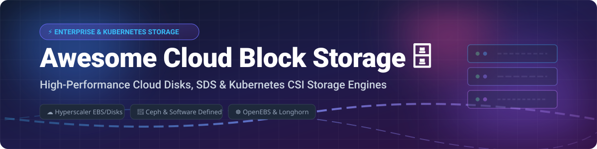

# Awesome-Cloud-Block-Storage

# Awesome-Cloud-Block-Storage 🗄️ ⚡

  

  

  

  

  

  

  

---

## 🌟 Top Cloud Block Storage Ecosystem

**Curated List of Commercial Block Storage Platforms & Open-Source Distributed Storage Systems**  

*Focused on High-Performance Block Volumes, Software-Defined Storage, Kubernetes Persistent Volumes & Self-Hosted Storage Clusters*

**Last updated: October 2026** 📅

---

### 📌 Overview & SEO Summary

Welcome to the ultimate curated directory of **cloud block storage platforms**, **open-source software-defined storage systems**, and **Kubernetes-native storage engines**. Whether you are looking for enterprise-grade commercial solutions (such as *Amazon EBS*, *Azure Managed Disks*, and *Pure Storage Cloud Block Store*), or self-hostable open-source alternatives (like *Ceph*, *OpenEBS*, and *LINSTOR*), this list covers category leaders, distributed storage architectures, and privacy-respecting persistent volume provisioning.

---

## 📑 Table of Contents

- [🏢 SaaS & Commercial Platforms](#-saas--commercial-platforms)

- [🔓 Open-Source GitHub Projects](#-open-source-github-projects)

- [🛠️ How to Contribute](#%EF%B8%8F-how-to-contribute)

- [📊 Star History](#-star-history)

- [🤝 Support & Sponsorship](#-support--sponsorship)

- [⚠️ Disclaimer](#%EF%B8%8F-disclaimer)

---

## 🏢 SaaS / Commercial Platforms

The cloud block storage market is dominated by hyperscaler offerings that integrate deeply with their compute ecosystems, alongside third-party storage vendors bringing enterprise SAN capabilities to the cloud. Pricing models vary: **AWS EBS** charges per GB-month with additional provisioned IOPS costs for io2 volumes; **Azure Managed Disks** offers Ultra, Premium SSD v1/v2, and Standard tiers with sub-millisecond latency on Ultra; **Google Cloud** provides Hyperdisk, Persistent Disk, and Local SSD with up to 500,000 IOPS on Hyperdisk Extreme. Third-party options like **Pure Storage Cloud Block Store** and **NetApp Cloud Volumes** bring on-premises SAN features to cloud environments for workload portability and hybrid cloud consistency.

| SaaS / Commercial Platform | Company / Owner | Valuation / Market Cap | Standard Edition Starting Price | Free Tier / Free Trial Limits | Description |

| :--- | :--- | :--- | :--- | :--- | :--- |

| **[Amazon Elastic Block Store (EBS)](https://aws.amazon.com/ebs/)** ☁️ | Amazon | ~$2.0 Trillion | **$0.0928/GB-month** (gp3); **$0.0058/provisioned IOPS** (io2, first 3,000 free)  | **Free tier: 30 GB of EBS storage for 12 months** (new AWS accounts) | **AWS-native block storage** — Available in gp3 (general purpose SSD), io2 Block Express (up to 256,000 IOPS), st1/sc1 (throughput/cold HDD). Snapshots for backup. Instance Store for temporary high-performance storage. |

| **[Azure Managed Disks](https://azure.microsoft.com/en-us/products/storage/disks/)** 🔷 | Microsoft | ~$3.90 Trillion | **Ultra, Premium SSD v1/v2, Standard SSD, Standard HDD** tiers | **Free tier: 64 GB of managed disk storage for 12 months** | **Azure-native block storage** — **Ultra Disk** delivers sub-millisecond latency for SAP HANA and top-tier databases. **Azure Elastic SAN** brings on-premises SAN capabilities to cloud with millions of IOPS and built-in DR. |

| **[Google Cloud Persistent Disk](https://cloud.google.com/persistent-disk/)** 🌐 | Google (Alphabet) | ~$2.0 Trillion | **$0.040/GB-month** (Standard); **$0.170/GB-month** (SSD) | **$300 free credits** for new customers | **GCP-native block storage** — **Hyperdisk Extreme** delivers **500,000 IOPS and 10 GiB/s throughput**. Persistent Disk for general workloads. Local SSD for temporary high-performance needs. |

| **[Pure Storage Cloud Block Store](https://www.purestorage.com/products/cloud-block-store.html)** 🟣 | Pure Storage | ~$15 Billion | Custom enterprise pricing | **Free trial available** | **Enterprise SAN in the cloud** — Brings Pure's Purity operating system to AWS and Azure for **workload portability** between on-premises and cloud. **Evergreen//One** offers unified subscription across on-prem, hosted, and public cloud. |

| **[NetApp Cloud Volumes](https://www.netapp.com/cloud/)** 🔵 | NetApp | ~$20 Billion | Pay-as-you-go per GB | **Free trial available** | **ONTAP in the cloud** — **Azure NetApp Files** is the first-party Azure service built on NetApp technology. **Keystone** provides single pay-as-you-go subscription spanning on-premises and cloud, with 99.999% uptime on Extreme and Premium tiers. |

| **[Blockbridge](https://blockbridge.com/)** 🧱 | Blockbridge | Private | Custom enterprise pricing | **Free trial available** | **Software-defined block storage for containers** — NVMe/TCP and iSCSI volumes for Kubernetes, Docker, and VMware. Zero-copy snapshots and replication. |

| **[Zadara Storage Cloud](https://www.zadara.com/)** ☁️ | Zadara | Private | **$0.25/GB-month** (estimated) | **Free trial available** | **Storage-as-a-Service (STaaS)** — Enterprise block, file, and object storage with consumption-based pricing. Available on AWS, Azure, GCP, and on-premises. |

| **[Silk Cloud Platform](https://www.silk.us/)** 🕸️ | Silk | Private | Custom enterprise pricing | **Free trial available** | **Cloud data platform** — Accelerates databases and applications by presenting cloud storage as local high-performance block devices. Used for SQL Server, Oracle, and SAP workloads. |

| **[Lightbits Cloud](https://www.lightbitslabs.com/)** ⚡ | Lightbits Labs | Private | **$0.12/GB-month** (estimated) | **Free trial available** | **NVMe/TCP software-defined block storage** — High-performance storage for Kubernetes and cloud-native workloads. Sub-millisecond latency with standard TCP networks. |

| **[StorPool](https://storpool.com/)** 📦 | StorPool | Private | Custom enterprise pricing | **Free trial available** | **Software-defined block storage** — High-performance storage for public and private clouds. Used by managed service providers for enterprise-grade block storage. |

---

## 🔓 Open-Source GitHub Projects

*Sorted by GitHub_Stars_Count (Descending)* 🌟

- **[Ceph](https://github.com/ceph/ceph)**   

  **The most widely deployed open-source distributed storage system**, LGPL-2.1 / GPL-2.0 / BSD-3-Clause licensed. **14,116 stars, 6,010 forks**. **Unified object, block, and file storage** from a single cluster built on commodity hardware. **RADOS** (Reliable Autonomic Distributed Object Store) is the foundation. **RBD** (RADOS Block Device) provides block storage for VMs, databases, and Kubernetes via the **Ceph CSI driver**. **Tentacle (v20)** introduced fast erasure coding for block workloads and an **NVMe over TCP gateway** for SAN-style access over Ethernet. **Rook** (CNCF graduated) is the preferred Kubernetes operator. **10-petabyte all-flash cluster sustaining a terabyte per second** demonstrated. 🐙

- **[OpenEBS](https://github.com/openebs/openebs)**   

  **Most popular container-native storage platform for Kubernetes**, Apache-2.0 licensed. **8,991 stars, 944 forks**. **Collection of data engines and operators** creating different types of **local and replicated persistent volumes** for Kubernetes Stateful workloads. **Stable engines**: Mayastor (NVMe over Fabrics), cStor (replicated block), Local PV (Hostpath, Device, ZFS, LVM). **Raw Block Volume support** — provides direct block device access for databases and storage infrastructure software running in Kubernetes. **CSI-compliant** with dynamic provisioning and storage classes. 🎯

- **[Longhorn](https://github.com/longhorn/longhorn)**   

  **Cloud-native distributed block storage for Kubernetes**, Apache-2.0 licensed. **100% open source, run anywhere** — no open core or proprietary alternatives. **Built-in incremental snapshots and backups** keep volume data safe in or out of the cluster. **Cross-cluster disaster recovery** with defined RPO/RTO. **Native virtual workload storage backend** — built-in virtual disk image management and **volume live-migration** for Harvester and KubeVirt integration. **Microservices architecture** isolates each volume operation to avoid cascading failures. **Chart version 1.11.2** (May 2026) includes snapshot nil-pointer fix. 🐂

- **[LINSTOR](https://github.com/LINBIT/linstor-server)**   

  **High-performance software-defined block storage**, open-source. **989 stars, 76 forks**. **Developed by LINBIT** — manages **replicated volumes across a group of machines** with native Kubernetes integration. **DRBD** integration provides **network replication**. **Separate data and control planes** for maximum availability. **Online live migration of back-end storage**. **LVM/ZFS snapshot support**, thin provisioning, RDMA, NVMe over Fabrics. **REST API** for integration and customization. **North-bound drivers** for CloudStack, Kubernetes, OpenNebula, OpenShift, OpenStack, Proxmox VE, and VMware. ⚡

- **[Curve](https://github.com/opencurve/curve)**   

  **CNCF sandbox distributed storage system**, Apache-2.0 licensed. **2,341 stars, 526 forks**. **Cloud-native, high-performance, easy to operate** — distributed storage for **block and shared file storage**. 🗂️

- **[MooseFS](https://github.com/moosefs/moosefs)**   

  **Petabyte-scale distributed file system and software-defined storage**, GPL-3.0 licensed. **1,705 stars, 209 forks**. **Fault-tolerant, highly performing, scalable** network distributed storage. 📦

- **[Sheepdog](https://github.com/sheepdog/sheepdog)**   

  **Distributed storage system for QEMU**, GPL-2.0 licensed. **988 stars, 263 forks**. **Block-level storage for KVM/QEMU virtual machines** — provides highly available block volumes. 🐑

- **[DAOS](https://github.com/daos-stack/daos)**   

  **Exascale-class distributed storage stack**, Apache-2.0 licensed. **763 stars, 301 forks**. **Intel-led** — designed for **next-generation HPC and AI workloads** with NVMe and PMEM support. 🔬

- **[LizardFS](https://github.com/lizardfs/lizardfs)**   

  **Open-source distributed file system**, GPL-3.0 licensed. **944 stars, 189 forks**. **MooseFS fork** with additional features. 🦎

- **[Ceph NVMe-oF Gateway](https://github.com/ceph/ceph-nvmeof)**   

  **Service providing Ceph storage over NVMe-oF/TCP protocol**, open-source. **90 stars, 45 forks**. **Presents block storage to any standard NVMe initiator** — highly available, SAN-style access over ordinary Ethernet with no proprietary hardware. 🔗

- **[Terraform IBM Cluster Storage Module](https://github.com/terraform-ibm-modules/terraform-ibm-cluster-storage)**   

  **Terraform module for IBM Cloud cluster storage**, Apache-2.0 licensed. **Creates and configures different storage types** like Portworx, object storage, and file storage for IBM Cloud clusters. ☁️

---

## 🛠️ How to Contribute

Contributions are welcome! Follow these steps to submit new cloud block storage platforms or open-source storage software:

1. 🍴 **Fork** the repository.

2. 📝 **Add/edit** entries in `README.md` maintaining table/list structure and formatting.

3. 🔗 Include project title, official website/GitHub link, exact Stars_Count, license, and brief description.

4. 🚀 Submit a **Pull Request** with a descriptive summary of your changes.

---

## 📊 Star History

---

## 🤝 Support & Sponsorship

If you find this cloud block storage repository useful, please consider supporting the project:

- ⭐ **Star** this repository to increase visibility!

- 🔀 **Fork** and share with fellow storage engineers, SREs, and open-source advocates.

- ☕ **Sponsor & Buy Me a Coffee**: Support ongoing open-source curation via the [GitHub Sponsor Dashboard](https://github.com/sponsors/ishandutta2007).

---

## ⚠️ Disclaimer

- This is a **community-curated** list — not exhaustive and not an endorsement. ℹ️

- **Ceph is the dominant open-source choice** for software-defined block storage, but **operational complexity is significant** — it requires at least three nodes for quorum and DRBD replication, and production deployments benefit from dedicated storage expertise. **Longhorn** and **OpenEBS** are simpler Kubernetes-native alternatives that trade some scalability for ease of management.

- **Cloud-native block storage costs accumulate from provisioned IOPS**, not just GB-month. AWS io2 volumes charge **$0.0058 per provisioned IOPS** beyond the first 3,000. **Google Hyperdisk Extreme** delivers 500,000 IOPS but at premium pricing.

- Open-source solutions (Ceph, OpenEBS, Longhorn, LINSTOR) provide self-hosted ownership and transparency, but enterprise-grade SLA guarantees, 24/7 support, and managed infrastructure remain primarily commercial offerings. **Always benchmark IOPS, throughput, and latency for your specific workload** before committing. ⚡

---

  <b>Made with ❤️ for storage engineers, SREs, and open-source block storage advocates.</b>

